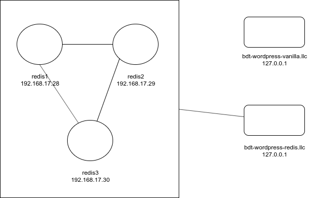
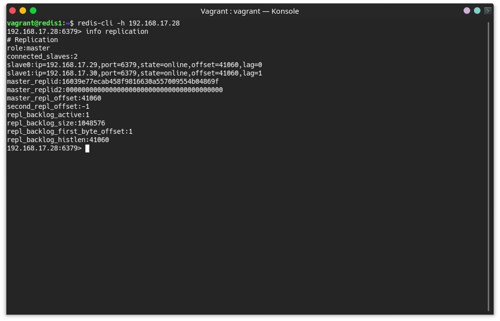
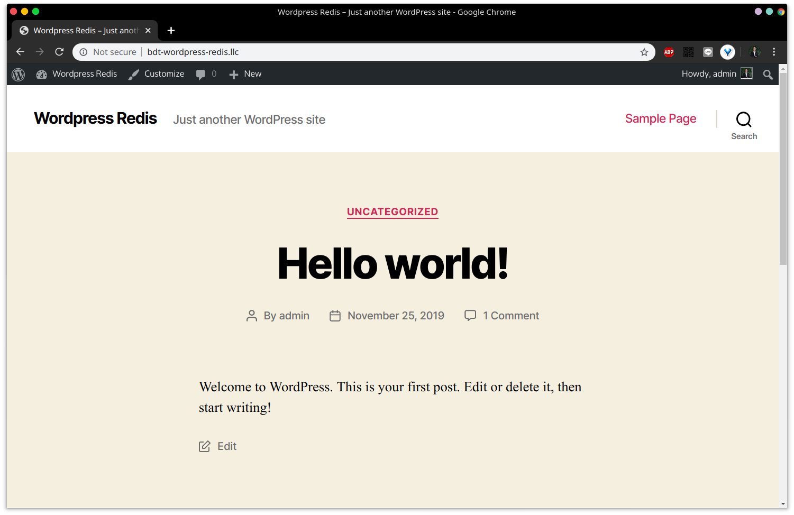
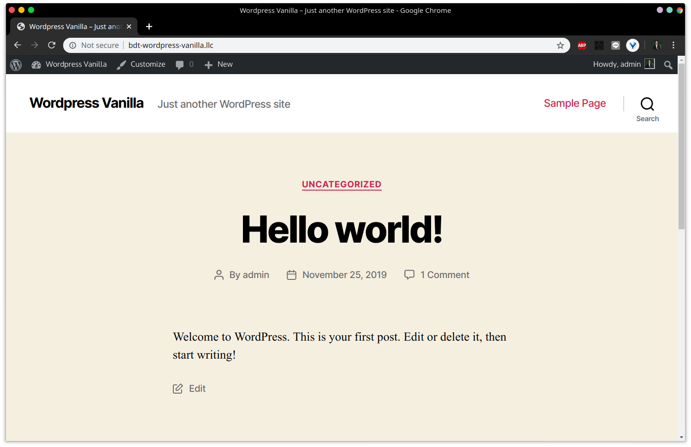
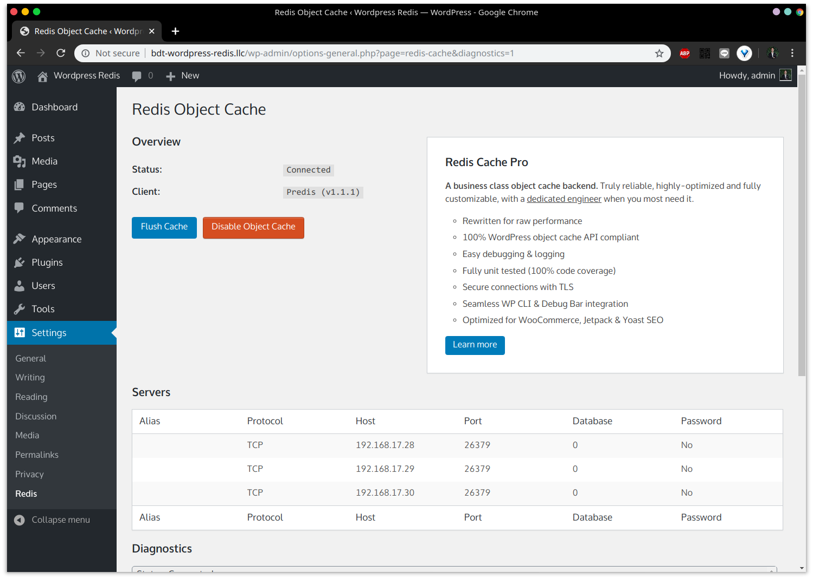
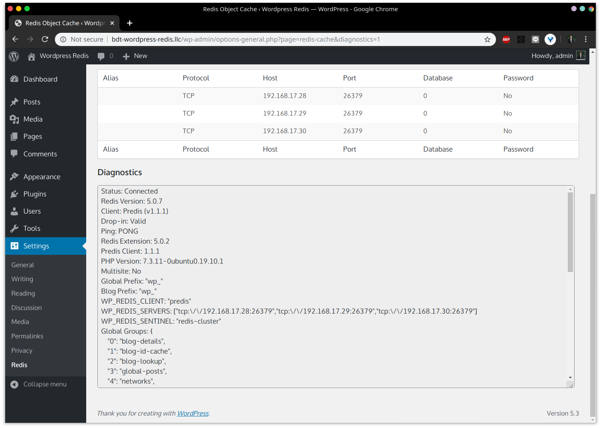
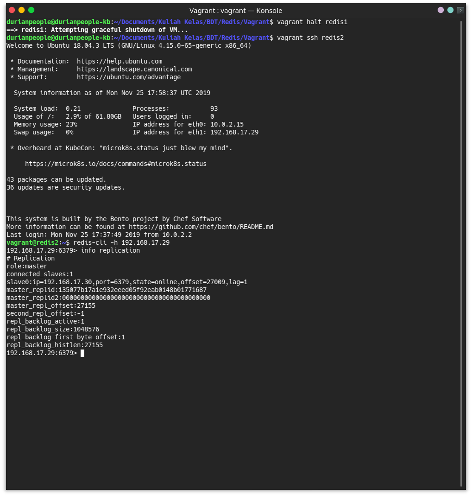
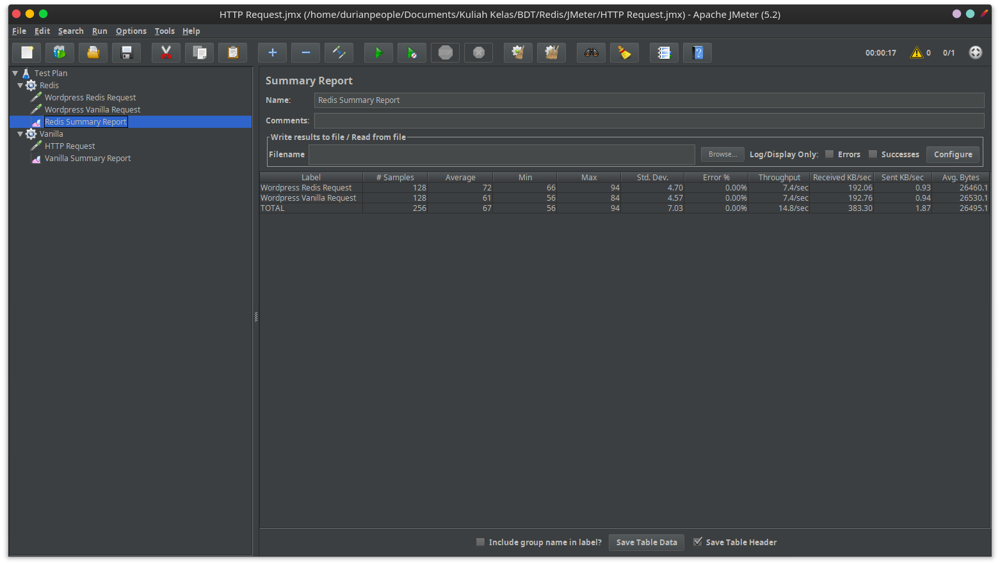
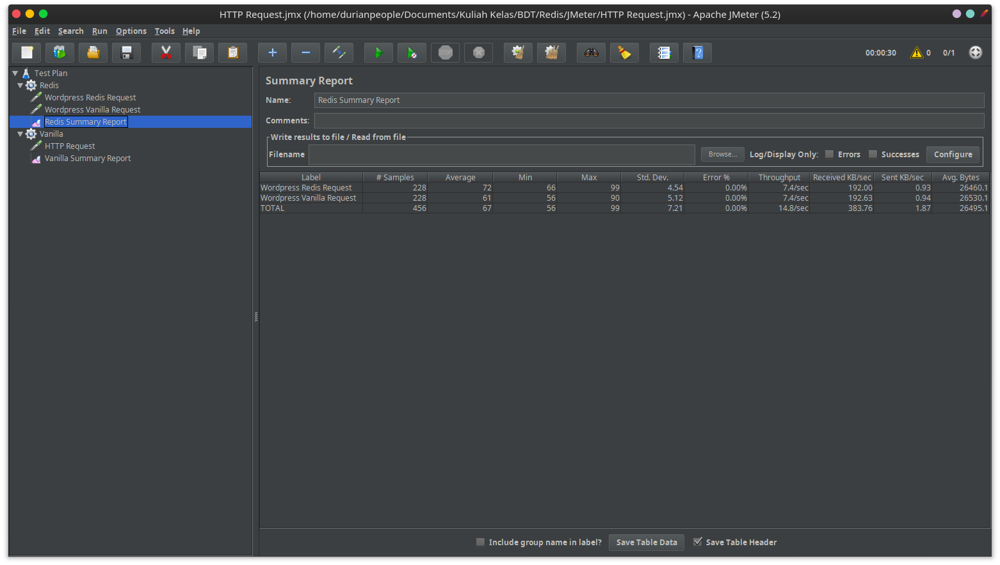

# BDT - Redis Cluster

## Arsitektur



| Nama node/domain          | Alamat IP     | Spesifikasi                         | Keterangan             |
| ------------------------- | ------------- | ----------------------------------- | ---------------------- |
| redis1                    | 192.168.17.28 | bento/ubuntu-18.04, 512MB RAM       | Master                 |
| redis2                    | 192.168.17.29 | bento/ubuntu-18.04, 512MB RAM       | Slave                  |
| redis3                    | 192.168.17.30 | bento/ubuntu-18.04, 512MB RAM       | Slave                  |
| bdt-wordpress-vanilla.llc | 127.0.0.1     | Kubuntu 19.10 (host), up to 8GB RAM | Wordpress tanpa Redis  |
| bdt-wordpress-redis.llc   | 127.0.0.1     | Kubuntu 19.10 (host), up to 8GB RAM | Wordpress dengan Redis |

*Keterangan: RAM yang tersedia untuk Wordpress di komputer host tergantung penggunaan RAM seluruh sistem, termasuk Vagrant. Seluruh aplikasi, termasuk box Vagrant, tidak dimatikan saat testing Wordpress*

## Konfigurasi Vagrant

Membuat `Vagrantfile` untuk Redis cluster dengan spesifikasi pada tabel di atas. Provisioning untuk node `redis#{i}`:

```shell
sudo cp /vagrant/sources/hosts /etc/hosts
sudo cp '/vagrant/sources/sources.list' '/etc/apt/'

sudo apt update -y

sudo apt-get install build-essential tcl libjemalloc-dev -y

curl -O http://download.redis.io/redis-stable.tar.gz
tar xzvf redis-stable.tar.gz
cd redis-stable
make
# make test
sudo make install

sudo mkdir /etc/redis

sudo cp /vagrant/config/redis1.conf /etc/redis/redis.conf
sudo cp /vagrant/config/sentinel1.conf /etc/redis-sentinel.conf

sudo cp /vagrant/service/redis.service /etc/systemd/system/redis.service
sudo cp /vagrant/service/redis-sentinel.service /etc/systemd/system/redis-sentinel.service

sudo adduser --system --group --no-create-home redis
sudo mkdir /var/lib/redis
sudo chown redis:redis /var/lib/redis
sudo chmod 770 /var/lib/redis

sudo systemctl enable redis
sudo systemctl start redis

sudo chmod 777 /etc/redis-sentinel.conf
sudo systemctl enable redis-sentinel
sudo systemctl start redis-sentinel

sudo chmod -R 777 /etc/redis
sudo systemctl restart redis
```

Script di atas akan menggandakan file `redis.service` dan `redis-sentinel.service`, serta melakukan beberapa konfigurasi lain. Bagian penting pada `redis1` (master) adalah menambahkan kode berikut:

```shell
sudo chown redis:redis -R /etc/redis
```

sebelum `systemctl restart redis`, karena pada prakteknya terjadi error saat slave mencoba menghubungi master.

Konfigurasi `redis#{i}.conf`:

```shell
bind [IP node]
port 6379
dir "/etc/redis"
```

Untuk slave, tambahkan:

```shell
slaveof 192.168.17.28 6379
```

Konfigurasi `sentinel#{i}.conf`:

```shell
bind [IP node]
port 26379

sentinel monitor redis-cluster 192.168.17.28 6379 2
sentinel down-after-milliseconds redis-cluster 5000
sentinel parallel-syncs redis-cluster 1
sentinel failover-timeout redis-cluster 10000
```

Konfigurasi `redis.service`:

```
[Unit]
Description=Redis In-Memory Data Store
After=network.target

[Service]
User=redis
Group=redis
ExecStart=/usr/local/bin/redis-server /etc/redis/redis.conf
ExecStop=/usr/local/bin/redis-cli shutdown
Restart=always

[Install]
WantedBy=multi-user.target
```

Konfigurasi `redis-sentinel.service`:

```
[Unit]
Description=Redis Sentinel
After=network.target

[Service]
User=redis
Group=redis
ExecStart=/usr/local/bin/redis-server /etc/redis-sentinel.conf --sentinel
ExecStop=/usr/local/bin/redis-cli shutdown
Restart=always

[Install]
WantedBy=multi-user.target
```

Setelah melakukan `vagrant up`, berikut merupakan hasil dari `info replication` pada `redis1` dengan dua slave:



## Konfigurasi Wordpress

Download Wordpress dalam bentuk .zip dan *extract* ke dalam dua folder: satu dengan Redis, dan satu tanpa Redis. Atur pengaturan web server dan database agar sesuai.





## Konfigurasi Redis pada Wordpress

Install plugin `php-redis` pada komputer host:

```
sudo apt install php-redis
```

Pada instalasi Wordpress dengan Redis, tambahkan kode berikut ke dalam `wp-config.php`:

```php
define('FS_METHOD', 'direct'); // agar tidak menanyakan FTP user saat owner bukan www-data
define('WP_REDIS_CLIENT', 'predis');
define('WP_REDIS_SENTINEL', 'redis-cluster');
define('WP_REDIS_SERVERS', ['tcp://192.168.17.28:26379', 'tcp://192.168.17.29:26379', 'tcp://192.168.17.30:26379']);
```

Install plugin **Redis Object Cache**, aktifkan, dan masuk ke halaman settings. Klik tombol **Enable Object Cache** sehingga halaman pengaturan plugin menjadi sebagai berikut:





## Pengujian

### Fail-Over

Jalankan `vagrant halt redis1` untuk memastikan Redis master. Lalu, lakukan ssh ke `redis2` dan jalankan `info replication` dalam `redis-cli`:



`redis2` saat ini menjadi master.

### JMeter

- 50 request

  

  | Type    | Average (ms) | Min (ms) | Max (ms) |
  | ------- | ------------ | -------- | -------- |
  | Redis   | 76           | 68       | 146      |
  | Vanilla | 98           | 60       | 1725     |

  

- 128 request

  

  | Type    | Average (ms) | Min (ms) | Max (ms) |
  | ------- | ------------ | -------- | -------- |
  | Redis   | 72           | 66       | 94       |
  | Vanilla | 61           | 56       | 84       |

  

- 228 request

  

  | Type    | Average (ms) | Min (ms) | Max (ms) |
  | ------- | ------------ | -------- | -------- |
  | Redis   | 72           | 66       | 99       |
  | Vanilla | 61           | 56       | 90       |

**Kesimpulan**: Wordpress dengan Redis Cache lebih lambat daripada Wordpress tanpa Redis Cache. Hal ini dapat disebabkan kecepatan Redis yang lebih lambat (karena di dalam VM) dibandingkan MySQL dalam sistem host.

